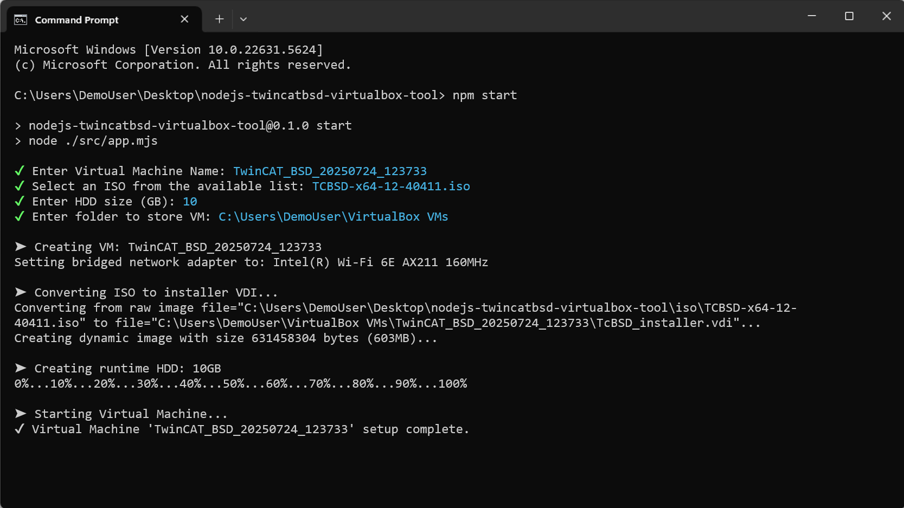

# Tools - Quick Make TwinCAT BSD Virtual Box VM

## Disclaimer

This guide is a personal project and not a peer-reviewed publication or sponsored document. It is provided “as is,” without any warranties—express or implied—including, but not limited to, accuracy, completeness, reliability, or suitability for any purpose. The author(s) shall not be held liable for any errors, omissions, delays, or damages arising from the use or display of this information.

All opinions expressed are solely those of the author(s) and do not necessarily represent those of any organization, employer, or other entity. Any assumptions or conclusions presented are subject to revision or rethinking at any time.

Use of this information, code, or scripts provided is at your own risk. Readers are encouraged to independently verify facts. This content does not constitute professional advice, and no client or advisory relationship is formed through its use.

## Description

This repository contains a tool I use to quickly start up TwinCAT/BSD VirtualBox VMs. It prompts for the desired ISO, VM name, and HDD size, then automatically sets up and launches a fully configured VM using VirtualBox.



## Getting Started

### Dependencies

- **Node.js** v22+
- **VirtualBox** installed at the default path: `C:\Program Files\Oracle\VirtualBox`
- A `.iso` image of TwinCAT BSD (download from [Beckhoff](https://www.beckhoff.com/en-au/support/download-finder/search-result/?download_group=586494792&download_item=586494816))

### Installation

```bash
git clone https://github.com/benhar-dev/nodejs-twincatbsd-virtualbox-tool.git
cd nodejs-twincatbsd-virtualbox-tool
npm install
```

## Usage

⚠️ Before starting, ensure you have at least one .iso in the iso folder!

```bash
npm start
```

Follow the prompts

1. Choose a VM name (default: TwinCAT*BSD*<timestamp>)
2. Select an .iso from the ./iso/ folder
3. Enter desired HDD size (default: 10GB)
4. Confirm the VM destination folder (defaults to VirtualBox's machine folder)

## What It Does

1. Checks for VBoxManage
2. Lists available .iso files in ./iso
3. Creates a VM with:
4. EFI and FreeBSD64 settings
5. Bridged network adapter (if available)
6. ISO converted to .vdi
7. Runtime disk as .vhd
8. Launches the VM .vbox file directly
